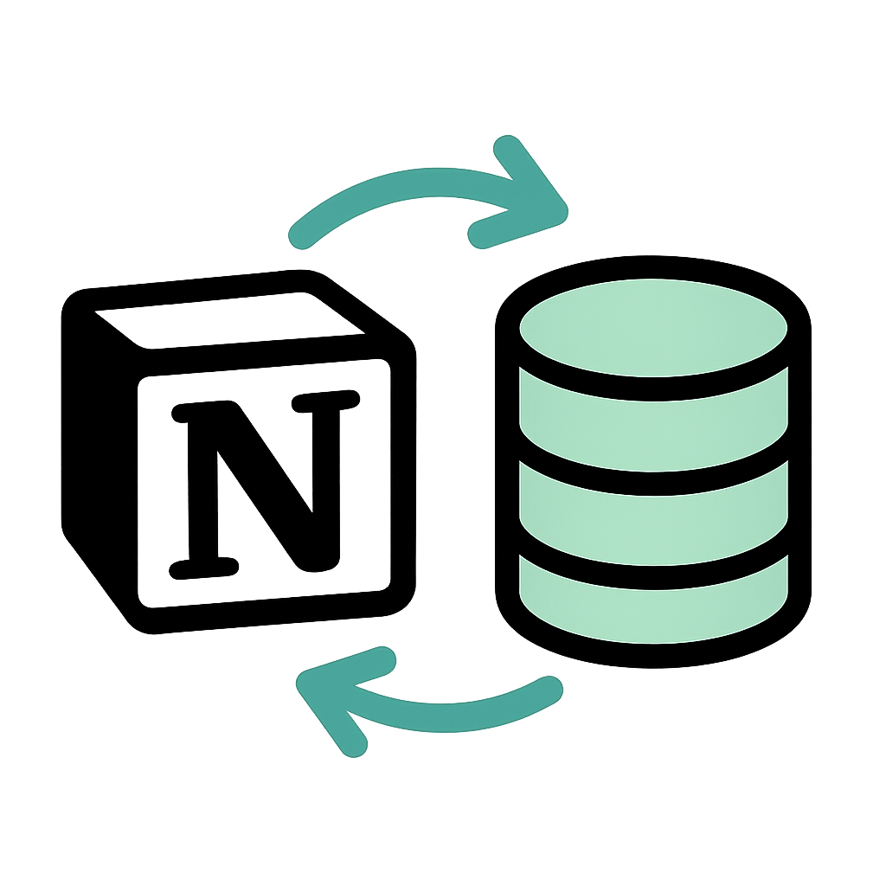

<div align="center">
  
</div>

# Notion → Postgres Sync

A reproducible stack that incrementally ingests Notion databases into a dedicated Postgres warehouse, with full run traceability via Dagster.

## Architecture

- **dlt pipelines**: Handles incremental sync from Notion API
- **Postgres**: Data warehouse container
- **Dagster OSS**: Orchestration and monitoring
- **Docker Compose**: Service orchestration

## Prerequisites

- macOS 14+ with Orbstack ≥ 0.18 (Docker & Compose drop-in)
- 4 GB free RAM
- Open ports: 5432, 3000

## Quick Start

### 1. Set up Notion Integration

#### Get Your Notion Token:
1. Go to **https://www.notion.so/my-integrations**
2. Click **"+ New integration"**
3. Give it a name like "Data Sync"
4. Select the workspace you want to sync from
5. Click **"Submit"**
6. Copy the **"Internal Integration Token"** (starts with `secret_`)

#### Get Your Database IDs:
1. Open the Notion databases you want to sync in your browser
2. Copy the database ID from the URL. For example:
   ```
   https://www.notion.so/workspace/32-character-string?v=...
                                  ↑ This is your database ID
   ```
3. If you have multiple databases, collect all their IDs

#### Share Databases with Integration:
1. In each Notion database, click the **"•••"** menu (top right)
2. Click **"Connections"** → **"Connect to"**
3. Search for your integration name and select it
4. Click **"Confirm"**

**📋 You'll need:**
- `NOTION_TOKEN`: Your integration token (secret_xxxx...)
- `NOTION_DB_ID`: Comma-separated database IDs (32-char-string1,32-char-string2)

### 2. Configure Environment

```bash
# Copy environment template
cp env.example .env

# Edit with your credentials
nano .env
```

Fill in:
- `NOTION_TOKEN`: Your integration token
- `NOTION_DB_ID`: Comma-separated database IDs
- Postgres credentials (or use defaults)

### 3. Start Services

```bash
# Build the code location service
docker compose build code

# Start all services in background
docker compose up -d

# Check status
docker compose ps
```

### 4. Access Dagster UI

Open http://localhost:3000 in your browser.

1. Go to "Deployment" → "Code locations" 
2. Add new location: `code_location` (Docker)
3. Navigate to "Assets" to see `notion_sync`
4. Click "Materialize" for manual run or enable the schedule

## Project Structure

```
notion2pg/
├─ code_location/
│  ├─ Dockerfile
│  ├─ requirements.txt
│  └─ defs.py           # Dagster assets + dlt pipeline
├─ docker-compose.yml
├─ env.example
├─ pipeline_state/      # Persistent .dlt state
└─ README.md
```

## Operations

### Manual Sync
In Dagster UI, go to Assets → `notion_sync` → "Materialize"

### Schedule
The pipeline runs daily at 04:30 Europe/Madrid timezone. Enable in Dagster UI under "Schedules".

### Logs
View real-time logs: `docker compose logs -f code`

### Backup
```bash
# Database backup
docker compose exec postgres_dwh pg_dump -U postgres analytics > backup.sql
```

## Troubleshooting

### Check service status
```bash
docker compose ps
docker compose logs dagster_web
```

### Reset state
```bash
# Clear pipeline state for fresh sync
rm -rf pipeline_state/*
docker compose restart code
```

### Port conflicts
If ports 3000 or 5432 are in use, modify `docker-compose.yml` port mappings.

## Next Steps

- Add unit tests with pytest + dagster dev
- Configure failure notifications
- Expand to other APIs
- Add dbt models downstream 